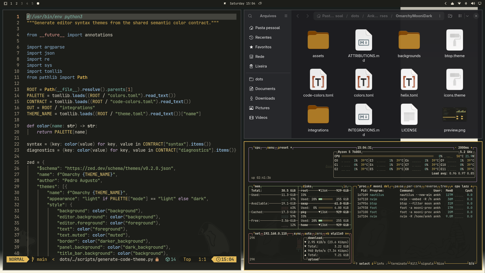

# Omarchy Mooni Dark

A warm charcoal, moon-gold and ivory dark theme for Omarchy.



## Installation

```sh
omarchy theme install https://github.com/PedroAugustoOK/omarchy-mooni-dark-theme
omarchy theme set mooni-dark
```

Cycle through the four wallpapers with `omarchy theme bg next`. The light
variant is available at [Omarchy Mooni](https://github.com/PedroAugustoOK/omarchy-mooni-theme).

The repository includes complete shell surfaces, Yaru Yellow icons, btop,
root-level VS Code and Helix color overrides, and thirteen optional integrations.
Three user-provided wallpapers are preserved without cropping or upscaling; the
fourth is a 3840×2160 Omarchy wordmark composition.

`preview.png` and `preview-unlock.png` are real captures from Omarchy. The lock
preview was opened through Omarchy's safe preview mode, without locking the
session. `unlock.png` belongs to the separate Plymouth disk-unlock interface.

No VS Code reload hook is installed by this theme. See [INTEGRATIONS.md](INTEGRATIONS.md)
for optional app setup and [ATTRIBUTIONS.md](ATTRIBUTIONS.md) for image rights.

```sh
python3 scripts/generate-code-theme.py
python3 scripts/generate-integrations.py
python3 scripts/validate-theme.py
```

Code is licensed under [MIT](LICENSE).
