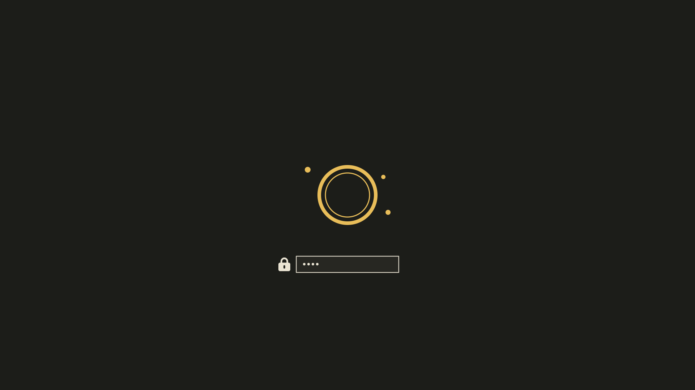

# Omarchy Mooni Dark

Carvão quente, amarelo lunar e texto marfim. Versão escura do Mooni,
com cores de código distintas e integrações geradas a partir da mesma paleta.


## Instalação

```sh
omarchy theme install https://github.com/PedroAugustoOK/omarchy-mooni-dark-theme
omarchy theme set mooni-dark
```

O tema aparecerá no seletor como **Mooni Dark**. Para alternar os wallpapers:

```sh
omarchy theme bg next
```

A versão clara está em
[Omarchy Mooni](https://github.com/PedroAugustoOK/omarchy-mooni-theme).

Nenhum hook adicional é necessário. O tema não instala extensões, altera atalhos
ou força recarregamento do VS Code. O comportamento de cache do editor continua
dependendo do Omarchy e do próprio VS Code.

## Conteúdo

- Barra, menus, notificações, autenticação, bloqueio e seletor de wallpapers.
- VS Code e Helix: overrides somente de cores na raiz, aplicados pelo Omarchy.
- Treze integrações opcionais em [INTEGRATIONS.md](INTEGRATIONS.md).
- Três wallpapers fornecidos pelo usuário, preservados sem cortes ou upscale.
- Quarto wallpaper com a logo vetorial oficial, renderizado em 3840×2160.
- Ícones Yaru Yellow, captura real do desktop e prévia fiel do Plymouth.

O wallpaper de Natal é mais claro e tem proporção diferente de 16:9; o ajuste
à tela depende do compositor. O primeiro wallpaper é o padrão escuro.

## Desenvolvimento

```sh
python3 scripts/generate-code-theme.py
python3 scripts/generate-integrations.py
sh scripts/render-assets.sh
python3 scripts/validate-theme.py
```

Python 3.11+; librsvg (`rsvg-convert`) apenas para renderizar os assets vetoriais.
Os PNGs já estão incluídos. `preview-unlock.png` reproduz o desbloqueio de disco
do Plymouth usando `unlock.png`, a paleta e a geometria oficial do Omarchy.
Neovim e terminais continuam seguindo os templates oficiais do sistema.

## Desbloqueio de disco



[Créditos e condições das imagens](ATTRIBUTIONS.md). Código: [MIT](LICENSE).
